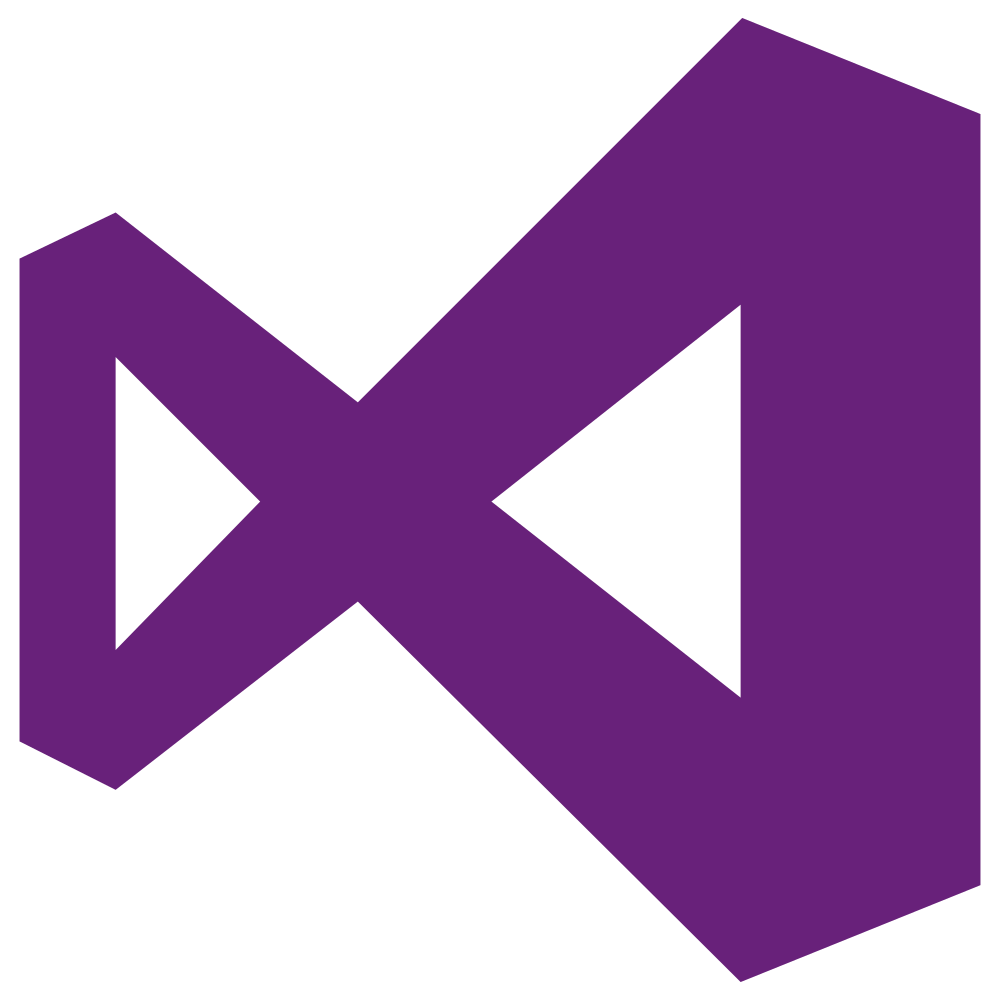

# 📈 - crypto-connect

crypto-connect is a CLI tool to keep track of cryptocurrencies.

## What are Cryptocurrencies?

A cryptocurrency (or crypto currency) is a digital asset designed to work as a medium of exchange that uses strong cryptography to secure financial transactions, control the creation of additional units, and verify the transfer of assets. Cryptocurrencies use decentralized control as opposed to centralized digital currency and central banking systems.

## Technology Stack

   

## Contributors

  

## License

[MIT](https://opensource.org/licenses/MIT)
